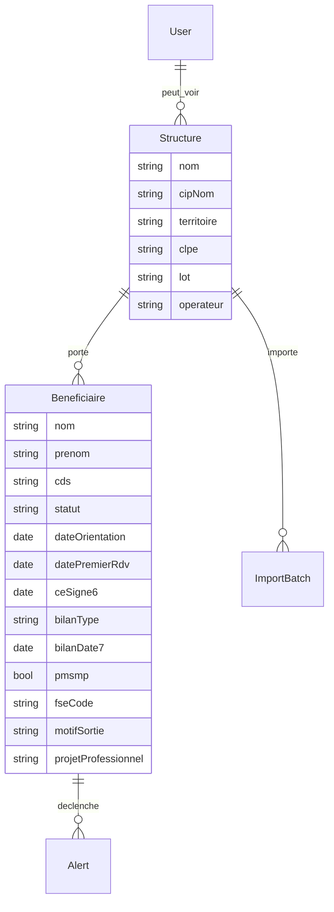
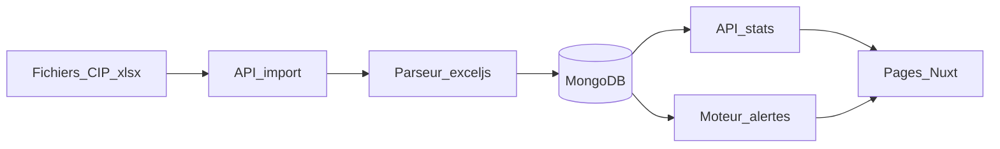

# Application de statistiques et alertes CIP+ (Nuxt 4 + MongoDB)

## Constat sur les sources

Le dossier [CDC](CDC) contient le modèle métier. Un fichier CIP n’est **pas** un tableau plat : 8 onglets, en-tête sur 7 lignes, dates Excel série, libellés instables.

**Fichier principal** [`CDC/1 REPORTING CELINE..xlsx`](CDC/1%20REPORTING%20CELINE..xlsx) (1 CIP, ~70 actifs + 124 sorties) :

- **Métadonnées en-tête** : `CIP : CELINE SARIGOL`, `Territoire: CDS OYONNAX NANTUA - LOT 2 / CLPE ZONE 4`, opérateur ALFA3A
- **Onglet actifs** (nom variable = territoire) et **BRSA SORTIES** : mêmes colonnes (identité, CDS, dates orientation/RDV/CE, bilan, PMSMP, motifs, FSE, dispositifs)
- **Sanctions + absence** : absences mensuelles + demandes de suspension (`Dde etude de situation`)
- **bilan de parcours + démarches** : dates de bilan 7e / 14e mois + type renouvellement
- **liste deroulante** : référentiels (motifs sortie, types positifs, réorientations)
- **CODIFICATION ACTIVITE** : codes FSE P01–P15 (besoins), distincts des codes `Saisie FSE` type `P44` (n° de dossier FSE)

**Export CD Ain** [`CDC/liste des orientations…xlsx`](CDC) : format différent (NIR, CLPE par personne). **Hors V1** — à brancher plus tard pour recouper les orientations officielles. En V1, le **CLPE est lu dans l’en-tête** de chaque fichier CIP (`CLPE ZONE 4`).

**Écart métier** : aucune colonne « projet professionnel ». V1 = champ structuré **saisissable dans l’app** après import (liste paramétrable), pour produire « liste des personnes par projets professionnels ».

## Périmètre V1

- Import des ~15 fichiers reporting homogènes (upload UI)
- Normalisation + stockage MongoDB
- Tableau de bord stats + listes exportables
- Moteur d’alertes + délai 1er RDV **paramétrable** (défaut 15 jours)
- 1 compte admin (graine), modèle User/rôles prêt pour CIP + coordinatrice

Hors V1 : import des extraits CD Ain, saisie quotidienne type tableur, multi-tenant complexe.

## Stack

- **Nuxt 4** (`app/`), API Nitro (`server/api/`)
- **MongoDB 7** + Mongoose
- **exceljs** (xlsx, dates, plusieurs onglets)
- **Nuxt UI** + Tailwind (FR)
- **Auth** : sessions Nitro + hash mot de passe (1 admin au seed)
- **Docker Compose** : `mongo` + `app` pour un lancement local unique

## Modèle de données



Collections :

- `structures` — une par fichier / CIP (Céline × Oyonnax-Nantua, etc.)
- `beneficiaires` — fiche unique `structureId + nomNormalise + prenomNormalise`
  - identité, CDS normalisé (`Oyonnax` / `Nantua`), dates CE 6 et 12 mois (2 colonnes homonymes `C.E SIGNE`)
  - `statut`: `actif` | `sortie`
  - bilan : type (`renouvellement` | `reo_ft` | `tripartite`) + dates 7e/14e mois fusionnées depuis l’onglet bilan
  - `dispositifs[]` : FLE, Déclic, MIFE, mobilité, etc. (valeur renseignée)
  - `absences` : 12 mois + absences avant CE
  - `suspensions` : demande d’étude de situation + dates
  - `projetProfessionnel` : saisi dans l’app
- `importBatches` — fichier, date, compteurs, avertissements de parsing
- `alerts` — type, gravité, bénéficiaire, message, `open` / `resolved`
- `users`, `settings` (délai 1er RDV, liste projets, référentiels)

**Règles de calcul (stats)**

| Indicateur | Règle |
|---|---|
| Orientations par CLPE × CIP | `dateOrientation` renseignée, groupé `clpe` + `cipNom` |
| Orientations par CIP | idem, groupé CIP |
| Sorties sans CE | `statut=sortie` et aucun `ceSigne6/12` |
| Accompagnement effectif | tous les dossiers **sauf** sorties sans CE — total et par CIP |
| Accompagnement par CIP | accompagnement effectif groupé CIP |
| CE signés | au moins une date CE |
| PMSMP | `pmsmp === true` (`1` dans Excel) |
| Bilans | ventilation `bilanType` |
| Liste FSE | bénéficiaires avec `fseCode` |
| Demandes de suspension | `suspensions.demande === true` |
| Taux d’absentéisme | absences mensuelles / (présentiels attendus) — formule affichée et ajustable |
| Personnes × projet pro | groupement `projetProfessionnel` |
| Dispositifs × CIP × territoire | un compteur par dispositif renseigné |

**Règles d’alerte (recalculées à chaque import + à la volée)**

| Alerte | Condition |
|---|---|
| Délai 1er RDV dépassé | `dateOrientation` présente et (`datePremierRdv` vide **ou** écart > seuil paramétré) |
| Absence de CE | `actif` et aucun CE, après 1er RDV (ou après le seuil si pas de RDV) |
| Absence de dates de bilan | échéance 7e mois (CE+6 mois) ou 14e mois dépassée, date manquante |
| Absence FSE | `fseCode` vide (actifs ; sorties avec CE) |
| Absence de bilan | échéance 7e mois dépassée et `bilanType` vide |

CDS : normalisation casse/accents à l’import. Référentiels (motifs, types positifs) chargés depuis l’onglet `liste deroulante` + table `settings`.

## Architecture applicative



**Parseur** [`server/utils/parseCipWorkbook.ts`](server/utils/parseCipWorkbook.ts) :

1. Lire l’en-tête (CIP, CLPE, lot, territoire, opérateur)
2. Détecter les onglets par **mots-clés de colonnes**, pas par nom (le 1er onglet change selon le territoire)
3. Convertir dates série Excel
4. Fusionner actifs / sorties / absences / bilans par nom+prénom
5. Retourner un rapport : lignes OK, ignorées, homonymes, colonnes inconnues

**API Nitro**

- `POST /api/auth/login` · `GET /api/auth/me`
- `POST /api/imports` (multipart) · `GET /api/imports`
- `GET /api/stats` (query `cip`, `clpe`, `territoire`, `cds`)
- `GET /api/alerts` · `PATCH /api/alerts/:id`
- `GET/PATCH /api/beneficiaires` (filtre + `projetProfessionnel`)
- `GET/PATCH /api/settings`

**Pages**

- `/login`
- `/` tableau de bord KPI + alertes ouvertes
- `/statistiques` blocs du cahier des charges + filtres CIP / CLPE / territoire
- `/alertes` liste filtrable, lien vers la fiche
- `/beneficiaires` liste + fiche (dispositifs, absences, projet pro)
- `/imports` upload + historique + rapport
- `/parametres` délai RDV, projets pro, utilisateurs (admin)

## Arborescence initiale

```
app/pages/, app/components/, app/layouts/
server/api/{auth,imports,stats,alerts,beneficiaires,settings}/
server/models/  server/utils/parseCipWorkbook.ts  server/utils/computeAlerts.ts
shared/types/
docker-compose.yml  .env.example
```

Jeu de démo : le fichier Céline du dossier CDC pour valider parseur + stats + alertes.

## Points d’attention

- 2 colonnes `C.E SIGNE` (6 mois vs 12 mois) : mapping par position (cols 9 et 12), pas par titre
- Homonymes possibles entre onglets : rapport d’import, pas de fusion silencieuse si ambigu
- Fichiers légèrement divergents : mapping souple + rapport « colonne non reconnue »
- Données personnelles (RSA) : app locale, pas de commit des xlsx, `.env` hors git

## Vérification

Après implémentation : parcours navigateur (login → import Céline → dashboard → stats → alertes → fiche → délai paramétrable). Contrôles attendus sur ce fichier : ~194 dossiers, 123 sorties sans CE, 8 PMSMP actifs, FSE ~55/70 actifs, bilans renouvellement / tripartite / réo FT.